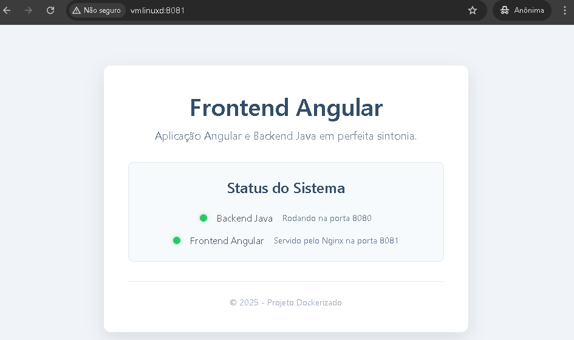

<!-- 
  Tags: Dev
  Label: ☕️ Hello word Java + angular 
  Description: Hello word Java + angular 
  path_hook: hookfigma.hook7
-->
# 🚀 Aplicação Full-Stack: Angular + Java Spring Boot

Uma aplicação completa com frontend Angular e backend Java Spring Boot, totalmente containerizada com Docker.



## 📋 Índice

- [Visão Geral](#-visão-geral)
- [Tecnologias Utilizadas](#-tecnologias-utilizadas)
- [Estrutura do Projeto](#-estrutura-do-projeto)
- [Pré-requisitos](#-pré-requisitos)
- [Instalação e Execução](#-instalação-e-execução)
- [Configuração](#-configuração)
- [Uso](#-uso)
- [Arquitetura](#-arquitetura)
- [Solução de Problemas](#-solução-de-problemas)
- [Contribuição](#-contribuição)

## 🎯 Visão Geral

Esta aplicação demonstra uma arquitetura full-stack moderna utilizando:
- **Frontend**: Angular 17 servido via Nginx
- **Backend**: Java Spring Boot 
- **Containerização**: Docker e Docker Compose
- **Comunicação**: REST API entre frontend e backend

## 🛠 Tecnologias Utilizadas

### Frontend
- **Angular 17** - Framework TypeScript para SPAs
- **TypeScript** - Linguagem principal
- **Nginx** - Servidor web para produção
- **Node.js 18** - Runtime para build

### Backend
- **Java 17** - Linguagem de programação
- **Spring Boot** - Framework Java
- **Maven** - Gerenciador de dependências

### DevOps
- **Docker** - Containerização
- **Docker Compose** - Orquestração de containers
- **Multi-stage builds** - Otimização de imagens

## 📁 Estrutura do Projeto

```
angular-frontend/
├── README.md
├── docker-compose.yml
├── setup_angular.sh
├── angular-app/
│   ├── Dockerfile
│   ├── nginx.conf
│   ├── package.json
│   ├── angular.json
│   ├── tsconfig.json
│   ├── tsconfig.app.json
│   └── src/
│       ├── index.html
│       ├── main.ts
│       ├── styles.css
│       └── app/
│           └── app.component.ts
└── java-app/
    ├── Dockerfile
    ├── pom.xml
    └── src/
        └── main/
            └── java/
                └── com/
                    └── example/
                        └── helloworld/
                            └── HelloWorldApplication.java
```

## 📋 Pré-requisitos

- **Docker** (versão 20.10+)
- **Docker Compose** (versão 3+)
- **Git** (para clonar o repositório)

### Verificar instalações:
```bash
docker --version
docker-compose --version
```

## 🚀 Instalação e Execução

### 1. Clone/Configure o projeto

Se ainda não tem a estrutura Angular configurada:
```bash
chmod +x setup_angular.sh
./setup_angular.sh
```

### 2. Execute a aplicação

```bash
# Construir e executar todos os serviços
docker-compose up --build

# Ou executar em background
docker-compose up --build -d
```

### 3. Verificar se está funcionando

Aguarde alguns minutos para o build completar, então acesse:

- **Frontend Angular**: http://localhost:4200 ou http://localhost:8081
- **Backend Java**: http://localhost:8080

## ⚙️ Configuração

### Portas utilizadas:
- **4200**: Frontend Angular (Nginx) - Porta principal
- **8081**: Frontend Angular (Nginx) - Porta alternativa
- **8080**: Backend Java (Spring Boot)

### Variáveis de ambiente:
- `SPRING_PROFILES_ACTIVE=docker` - Perfil do Spring Boot

### Customização:

Para alterar portas, edite o `docker-compose.yml`:
```yaml
ports:
  - "PORTA_HOST:PORTA_CONTAINER"
  # Exemplo: múltiplas portas para o mesmo serviço
  - "4200:80"
  - "8081:80"
```

## 💻 Uso

### Comandos úteis:

```bash
# Parar todos os serviços
docker-compose down

# Ver logs em tempo real
docker-compose logs -f

# Ver logs de um serviço específico
docker-compose logs -f frontend-angular
docker-compose logs -f backend-java

# Reconstruir apenas um serviço
docker-compose up --build frontend-angular

# Entrar no container (debug)
docker exec -it frontend-angular sh
docker exec -it backend-java bash

# Limpar cache do Docker
docker system prune -f
```

### Desenvolvimento:

Para desenvolvimento local sem Docker:

**Backend:**
```bash
cd java-app
mvn spring-boot:run
```

**Frontend:**
```bash
cd angular-app
npm install
npm start
```

## 🏗 Arquitetura

### Fluxo de dados:
1. **Cliente** acessa `http://localhost:4200` ou `http://localhost:8081`
2. **Nginx** serve a aplicação Angular
3. **Angular** faz requisições para `http://localhost:8080`
4. **Spring Boot** processa e retorna dados
5. **Rede Docker** conecta os containers

### Containers:
- `frontend-angular`: Nginx + aplicação Angular compilada
- `backend-java`: JVM + aplicação Spring Boot
- `mynetwork`: Rede bridge para comunicação

### Multi-stage builds:
- **Frontend**: Node.js (build) → Nginx (runtime)
- **Backend**: Maven + OpenJDK (build) → OpenJDK slim (runtime)

## 🔧 Solução de Problemas

### Erro: "This command is not available when running the Angular CLI outside a workspace"
```bash
# Execute o script de setup
./setup_angular.sh
```

### Erro: "404 Not Found - karma-chrome-headless"
```bash
# Verifique se o package.json usa karma-chrome-launcher
grep -n "karma-chrome" angular-app/package.json
```

### Erro: "Port already in use"
```bash
# Verificar processos usando as portas
sudo netstat -tlnp | grep :4200
sudo netstat -tlnp | grep :8081
sudo netstat -tlnp | grep :8080

# Parar containers existentes
docker-compose down
```

### Container não inicia:
```bash
# Ver logs detalhados
docker-compose logs

# Verificar status dos containers
docker-compose ps

# Reconstruir do zero
docker-compose down
docker system prune -f
docker-compose up --build
```

### Build lento:
```bash
# Usar cache do Docker
docker-compose build --parallel

# Limpar apenas imagens não utilizadas
docker image prune -f
```

## 🤝 Contribuição

1. Fork o projeto
2. Crie uma branch para sua feature (`git checkout -b feature/AmazingFeature`)
3. Commit suas mudanças (`git commit -m 'Add some AmazingFeature'`)
4. Push para a branch (`git push origin feature/AmazingFeature`)
5. Abra um Pull Request

### Padrões de código:
- **Angular**: Seguir o Angular Style Guide
- **Java**: Seguir convenções do Spring Boot
- **Docker**: Multi-stage builds para otimização

## 📝 Notas Técnicas

### Configuração de portas:
- O frontend está configurado para ser acessível em **duas portas diferentes** (4200 e 8081)
- Isso oferece **flexibilidade** de acesso e pode ser útil para:
  - Testes simultâneos com diferentes usuários
  - Ambientes de desenvolvimento e demonstração
  - Load balancing ou redundância

### Otimizações implementadas:
- **Multi-stage builds** para imagens menores
- **Nginx gzip** para compressão de assets
- **Cache de dependências** no Docker
- **Configuração SPA** para roteamento Angular

### Segurança:
- **Headers de segurança** no Nginx
- **Portas expostas** apenas as necessárias
- **Usuários não-root** nos containers (recomendado para produção)

---

## 👨‍💻 Autor

[Fabiano Rocha/Fabiuniz](https://github.com/SeuUsuarioGitHub)

## Licença

Este projeto está licenciado sob a [MIT License](LICENSE).